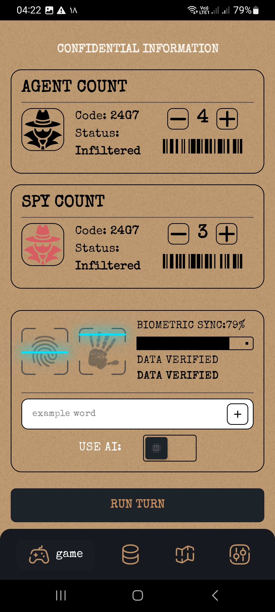

🕵️ Spy Manager

🎮 بازی گروهی جاسوسی و معمایی برای دورهمی‌ها

یک بازی گروهی سرگرم‌کننده که بازیکنان در آن نقش‌های مختلفی دریافت می‌کنند و با استفاده از سرنخ، گفتگو و دقت تلاش می‌کنند جاسوس را شناسایی کنند.

🚧 وضعیت پروژه: در حال migrate به معماری تمیز و فیچر بیس شدن

---

📱 Screenshots

  
  &nbsp;&nbsp;&nbsp;&nbsp;
  

  تصاویر مربوط به نسخه فعلی برنامه هستند.

---

🎯 درباره پروژه

Spy Manager یک بازی گروهی Android است که با هدف ایجاد تجربه‌ای ساده، سریع و سرگرم‌کننده برای دورهمی‌ها توسعه داده می‌شود.

این پروژه علاوه بر جنبه محصولی، بستری برای پیاده‌سازی و تمرین اصول مدرن توسعه Android، معماری نرم‌افزار و بهینه‌سازی عملکرد است.

در حال حاضر ساختار داخلی پروژه در حال بازطراحی و مهاجرت تدریجی به Clean Architecture است.

اهداف اصلی

- ایجاد معماری تمیز و قابل توسعه
- جداسازی صحیح مسئولیت‌ها
- افزایش تست‌پذیری
- بهبود قابلیت نگهداری کد
- بهینه‌سازی عملکرد برنامه
- ایجاد تجربه کاربری روان و ساده

---

✨ قابلیت‌ها

- 🕵️ سیستم نقش و جاسوس
- 👥 پشتیبانی از بازی گروهی
- 🎭 مدیریت نقش بازیکنان
- 🎯 مکانیزم شناسایی جاسوس
- 🎨 رابط کاربری مدرن و فارسی
- 🌙 طراحی مبتنی بر Material 3
- ⚡ تمرکز بر Performance و Startup
- 🧩 معماری قابل توسعه

---

🛠️ فناوری‌های استفاده‌شده

📱 Android

فناوری| کاربرد
Kotlin| زبان اصلی توسعه
Android SDK| پلتفرم توسعه
Jetpack Compose| ساخت رابط کاربری
Material 3| طراحی رابط کاربری
Navigation Compose| مدیریت Navigation
Coroutines| مدیریت عملیات Asynchronous
Flow| مدیریت جریان داده

🏗️ Architecture & Design

فناوری / الگو| کاربرد
Clean Architecture| جداسازی لایه‌های برنامه
MVVM / MVI| مدیریت State و منطق UI
Repository Pattern| مدیریت دسترسی به داده
Use Case| جداسازی منطق کسب‌وکار
Dependency Injection| مدیریت وابستگی‌ها
Hilt| پیاده‌سازی Dependency Injection

💾 Data & Networking

فناوری| کاربرد
Room| ذخیره‌سازی داده‌های محلی
Retrofit| ارتباط با REST API
OkHttp| مدیریت HTTP Requests
Kotlin Serialization| تبدیل داده‌ها

🧰 ابزارهای توسعه

- Android Studio
- Gradle
- KSP
- Git
- GitHub
- GitHub Actions

---

🏛️ معماری پروژه

Spy Manager در حال مهاجرت به Clean Architecture است.

ساختار معماری پروژه بر اساس سه لایه اصلی طراحی می‌شود:

┌─────────────────────────┐
│      Presentation       │
│   UI • State • Events   │
└────────────┬────────────┘
             ↓
┌─────────────────────────┐
│         Domain          │
│ Use Cases • Models      │
│ Repository Contracts    │
└────────────┬────────────┘
             ↓
┌─────────────────────────┐
│          Data           │
│ Local • Remote • Mapper │
└─────────────────────────┘

Presentation

مسئول رابط کاربری، مدیریت State، دریافت Eventها و نمایش وضعیت برنامه است.

Domain

هسته اصلی منطق برنامه است و شامل Modelها، Use Caseها و قرارداد Repositoryها می‌شود.

Data

مسئول ارتباط با منابع داده مانند Database و API و همچنین تبدیل داده‌ها به Modelهای مورد نیاز Domain است.

---

📂 ساختار پیشنهادی پروژه

app/
│
├── data/
│   ├── local/
│   ├── remote/
│   ├── repository/
│   └── mapper/
│
├── domain/
│   ├── model/
│   ├── repository/
│   └── usecase/
│
└── presentation/
    ├── screen/
    ├── component/
    ├── navigation/
    └── state/

«ساختار پروژه همزمان با فرآیند مهاجرت به Clean Architecture در حال تکمیل و بهینه‌سازی است.»

---

⚡ Performance

یکی از اهداف اصلی توسعه Spy Manager، کاهش زمان Startup و بهبود عملکرد اولیه برنامه است.

Startup Benchmark

حالت اجرا| میانگین زمان شروع
❌ بدون Baseline Profile| 1,231 ms
🚧 با Baseline Profile| در حال اندازه‌گیری

«Benchmarkها در شرایط یکسان اندازه‌گیری می‌شوند و نتایج نهایی پس از تکمیل فرآیند بهینه‌سازی ثبت خواهند شد.»

---

🚧 وضعیت توسعه

بخش| وضعیت
🎨 UI / UX| 🟢 در حال توسعه
🎮 Game Logic| 🟢 در حال توسعه
🏗️ Clean Architecture| 🟡 در حال مهاجرت
💉 Dependency Injection| 🟢 پیاده‌سازی شده
⚡ Performance| 🟡 در حال بهینه‌سازی
🧪 Unit Tests| 🟡 در حال توسعه
📚 Documentation| 🟡 در حال تکمیل

---

🗺️ Roadmap

- [x] ایجاد نسخه اولیه بازی
- [x] طراحی رابط کاربری اولیه
- [x] پیاده‌سازی قابلیت‌های اصلی
- [ ] تکمیل مهاجرت به Clean Architecture
- [ ] تکمیل لایه Domain
- [ ] افزایش پوشش Unit Test
- [ ] اضافه کردن Baseline Profile
- [ ] بهینه‌سازی Startup Performance
- [ ] بهبود UI / UX
- [ ] تکمیل سیستم بازی
- [ ] انتشار نسخه پایدار

---

👨‍💻 توسعه‌دهنده

Ali Mahjoob

Android Developer

Kotlin • Jetpack Compose • Clean Architecture

---

⭐ اگر پروژه برایتان جالب بود، با یک Star از آن حمایت کنید.

